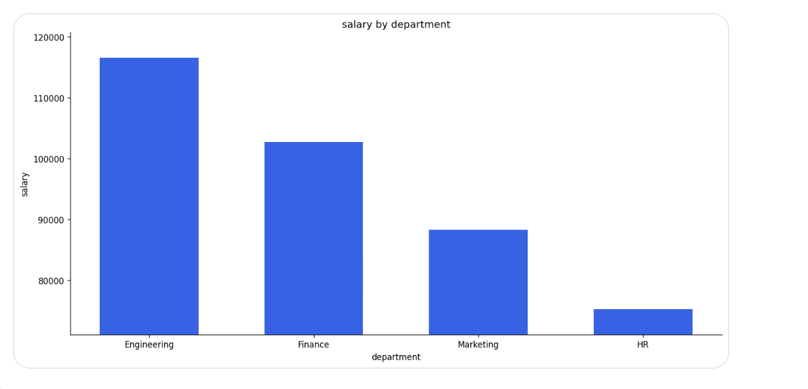
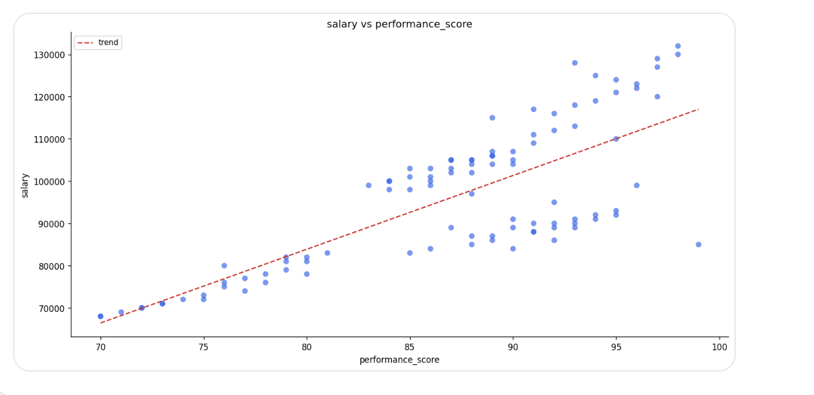
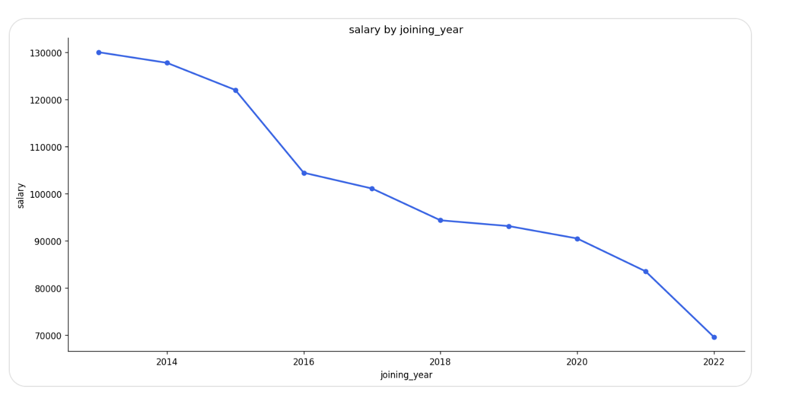

# 🤖 AI Data Analyst Agent

An AI-powered agent that lets you interact with CSV datasets using natural language. Upload a CSV, ask questions, generate charts, clean data, and export results — all through a simple chat interface.

🔗 **Live Demo → [ai-data-analyst-4m3o.onrender.com](https://ai-data-analyst-4m3o.onrender.com)**

---

## ✨ Features

- 💬 Ask questions about your data in plain English
- 📊 Generate charts and visualizations automatically
- 🧹 Clean data — remove duplicates, fill missing values
- ➕ Add, update, and delete rows through chat
- 📥 Export modified datasets as CSV
- 🗂️ Upload and switch between multiple datasets

---

## 📊 Chart Examples

The agent automatically picks the right chart type based on your question — no need to specify bar, scatter, or line.

### Bar Chart — Salary by Department
> `show salary by department`



---


### Scatter Plot — Experience vs Salary
> `salary by peformance_score`

Automatically detects both axes are numeric and renders a scatter plot with a trend line.



---

### Line Chart — Salary by Joining Year
> `salary by joining_year`

Detects year-based x-axis and switches to a line chart automatically.



### Explicit Axis Control
> `x axis = department, y axis = salary`
> `put joining_year on x axis and salary on y axis`

You can also specify axes directly when you need precise control.

---

## 💬 Example Questions

| Category | Example |
|---|---|
| Analysis | `what is the average salary by department?` |
| Analysis | `who has the highest performance score?` |
| Chart | `show salary by department` |
| Chart | `experience vs salary` |
| Chart | `show salary distribution` |
| Chart | `salary by joining_year` |
| Filter | `show employees with experience greater than 5` |
| Update | `update John's salary to 90000` |
| Delete | `delete employee named Raj` |
| Add | `add employee Alice, age 28, salary 75000` |
| Clean | `remove duplicates and fill missing values` |
| Export | `export the dataset` |

---

## 🛠️ Tech Stack

| Layer | Technology |
|---|---|
| Backend | Python, Flask |
| AI / LLM | Groq API, Llama 3.3 70B |
| Data Processing | Pandas |
| Visualization | Matplotlib |
| Storage | MongoDB Atlas, Cloudinary |
| Frontend | HTML, CSS, JavaScript |

---


## 📁 Project Structure

```
ai-data-analyst/
├── agent/
│   ├── tool_agent.py       # main agent loop
│   ├── analysis_agent.py   # pandas code execution
│   ├── multi_step.py       # multi-step question handling
│   └── tool_registry.py    # tool definitions
├── tools/
│   ├── chart_tool.py       # smart chart generation
│   ├── query_tool.py       # data querying
│   ├── update_tool.py      # row updates
│   ├── delete_tool.py      # row deletion
│   ├── add_row_tool.py     # row insertion
│   └── cleaning_tool.py    # data cleaning
├── helpers/
│   ├── chart_helper.py     # axis parsing from natural language
│   └── dtype_helper.py     # dataframe type preparation
├── assets/
│   └── examples/           # chart screenshots for README
├── app.py
└── requirements.txt
```
